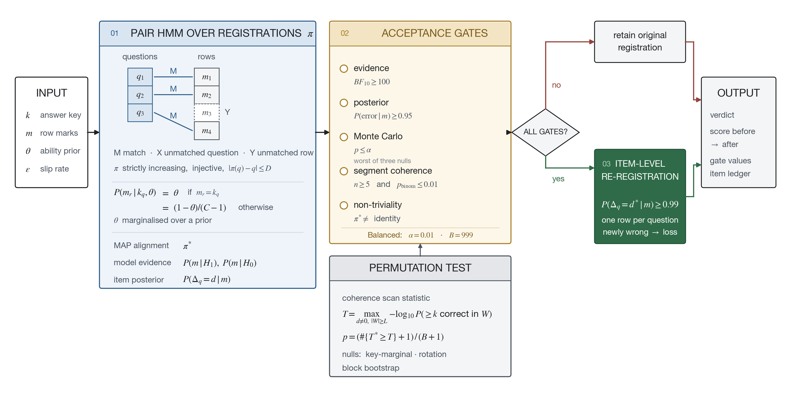
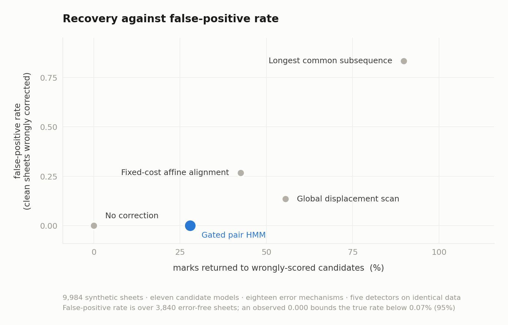

# Detecting registration errors in OMR answer sheets

This repository studies a narrow problem in optical mark recognition (OMR): the
marks were recorded correctly, but the rows are being compared with the wrong
questions. A skipped bubble row and a scanner feed slip create the same index
error, so the detector treats them alike. It does not infer which cause occurred.

The project is a research implementation, not an operational marking system.
All evaluation is synthetic. The repository contains one real disputed-sheet
analysis, but it is a case study rather than validation data. No claim here
establishes performance on a live examination.

## What the detector does

The recommended method is a three-state pair hidden Markov model over possible
paths through the question/row grid. A path can match a question to its original
row, move to a nearby row, or leave a question or row unmatched, but it must stay
monotone and cannot reuse a physical row. The model never edits or invents a mark.
Candidate ability is integrated over a prior and is not fitted to the disputed
sheet.



An alignment is accepted only if all five checks pass:

- Bayes factor for a non-identity registration at least 100;
- posterior probability of a registration error at least 0.95, using the
  configured sheet-level slip rate as prior odds;
- Monte Carlo coherence p-value at most the selected profile level, using the
  worst of three null models;
- every displaced segment has at least five items and is above chance at the
  exact binomial p ≤ 0.01 level; and
- the MAP alignment is not the identity.

After acceptance, marks are re-registered one question at a time only when the
posterior for that question’s offset is at least 0.99. Newly incorrect answers count
as losses. This prevents a favourable alignment from being applied wholesale.

Blank rows and unanswered questions are different: a blank physical row shifts
later marks, while an unanswered question lets the registration catch up. The
implementation represents this with a strictly increasing injection.

## Main results

The shipped default is the Balanced profile (Monte Carlo level 0.01, 999 draws).
The headline results below are committed synthetic outputs. “Recovery” measures
marks returned after a planted error; “power” counts only correctly localized
detections. Neither is a live-paper performance estimate.

### Corpus 1: model comparison

This corpus contains 480 synthetic sheets: ten candidate-response generators,
three injected error conditions, and 12 error-free sheets per generator. FPR is
the fraction of clean sheets that were wrongly corrected; recovery is the share
of marks lost to a planted error that the method returns; unearned marks are
marks awarded that the constructed truth says were not earned. The table reports
the pooled summary in `results/benchmark.txt`; each generator’s FPR is also
reported separately there.

| Detector | Worst clean-sheet FPR | Recovery | Unearned marks, raw | Unearned marks reweighted to 1.8% |
|---|---:|---:|---:|---:|
| No correction | 0.000 | 0% | 0.19 | 0.005 |
| Global displacement scan | 0.417 | 31% | 0.47 | 0.239 |
| Longest common subsequence | 1.000 | 100% | 4.21 | 3.688 |
| Fixed-cost affine alignment | 1.000 | 99% | 1.46 | 1.084 |
| **Gated pair HMM** | **0.000** | **33%** | **0.19** | **0.005** |

The raw unearned-mark column averages cells containing three error sheets per
error-free sheet, so it is not a deployment expectation. The 1.8% column applies
the historical rate reported by Skiena and Sumazin (2004); it is a sensitivity
calculation, not a local prevalence estimate. A zero observed false-positive rate
is not zero risk: 12 clean sheets per generator gives a 95% exact upper bound of
22.1% for an individual generator.

### Corpus 2: independent large benchmark

The second corpus contains 9,984 synthetic sheets generated by separate code,
with 3,840 clean sheets and 6,144 error sheets. It includes 11 response models,
18 error mechanisms, scanner artefacts, several paper lengths, and five-option
conditions. All five detectors were scored on the same sheets.

| Detector | False positives / clean | FPR | Correctly localized power | Recovery | Unearned marks |
|---|---:|---:|---:|---:|---:|
| No correction | 0 / 3,840 | 0.0000 | 0% | 0% | 2,665 |
| **Gated pair HMM** | **0 / 3,840** | **0.0000** | **11.2%** | **27.9%** | **2,703** |
| Global displacement scan | 520 / 3,840 | 0.1354 | 7.6% | 55.5% | 11,065 |
| Fixed-cost affine alignment | 1,028 / 3,840 | 0.2677 | 18.3% | 42.5% | 29,940 |
| Longest common subsequence | 3,201 / 3,840 | 0.8336 | 0% | 89.8% | 141,249 |

The gated detector returned 29,036 marks that were genuinely at stake and
awarded 2,703 unearned marks. The no-correction floor was 2,665, so the detector
added 38 unearned marks in this synthetic corpus. It detected 895 sheets, of
which 207 were localized incorrectly. The zero-FP observation has a pooled 95%
upper bound of 0.07%, not a proof of zero risk.



The figure uses the same committed corpus summary as the table. Recovery is the
share of genuinely lost marks returned; the horizontal safety axis is the clean
sheet false-positive rate.

### Operating profiles

The profiles were measured separately on 150 synthetic 20-question papers with
single-row skips and abilities from 0.55 to 0.95. They are named operating
points, not calibrated false-positive rates.

| Profile | Level | Detections | Marks recovered | Recovery | Smallest accepted block |
|---|---:|---:|---:|---:|---:|
| Conservative | 0.001 | 23 / 150 | 280 / 1,220 | 23.0% | 11 |
| **Balanced** | **0.010** | **46 / 150** | **469 / 1,220** | **38.4%** | **9** |
| Sensitive | 0.050 | 63 / 150 | 558 / 1,220 | 45.7% | 8 |

In the accompanying certification arm, no profile accepted any of 1,500 clean
synthetic sheets at level 0.1, which is looser than all three profiles. The exact
95% upper bound is 0.20%. The absence of false positives in that sample does not
calibrate a profile for real papers.

## Case study

The motivating 46-question mathematics sheet was scored 7/46. The default
analysis returned a posterior shift probability of 0.023378, a Monte Carlo
p-value of 0.9010, and the identity alignment. No re-registration is supported;
the original score stands. A planted positive control on the same key is detected
and re-registered. The public case analysis is in [CASE_REPORT.md](CASE_REPORT.md).

## Important limitations

- Recovery is low and depends strongly on answer quality and error mechanism. In
  the committed validation output, one-row-shift power ranges from 0.333 at
  ability 0.55 to 0.933 at ability 0.85; two-row-shift power ranges from 0.067 to
  0.450 in those same conditions.
- In corpus 2, correctly localized power is 0.112 and 23% of detections are
  mislocalized. A flagged sheet can therefore receive no recovered credit.
- The coherence gate needs a contiguous run of evidence. On the profile study’s
  20-question papers, the smallest accepted displaced block was 8–11 correct
  marks depending on profile. Short papers and slips confined by sheet design are
  poorly served.
- Non-monotone events, such as answering a skipped question later, are not
  representable exactly. The mechanism benchmark treats the deferred answer as
  an approximate monotone alignment.
- Clean digitization is assumed in the core response sequence. Faint marks,
  erasures, and double marks should be inspected or rescanned first.
- Brier scores, posterior values, and false-positive bounds are synthetic or
  comparative unless explicitly labelled otherwise. There is no confirmed
  historical corpus in this repository.
- The 1.8% slip rate, maximum displacement of three rows, mechanism frequencies,
  and external-ability policy are assumptions or external inputs, not estimates
  learned here.

## Repository map

```text
REPORT.md                technical report and evidence audit
CASE_REPORT.md           motivating-sheet analysis
ASSUMPTIONS.md           design assumptions and measured outcomes
REPRODUCE.md             commands and reproducibility notes
data/                    answer data and corpus descriptions
omr_registration_audit/  the installable library (core, api)
provenance.py            records what produced each results file
benchmark/               corpus generators, comparisons, and controls
analysis/                case-study analyses
results/                 committed tables, JSON, figures, and provenance
```

## Quickstart

Python 3.9 or later is required. Detection uses the standard library; NumPy and
Matplotlib are used by the benchmark and figure scripts.

```bash
pip install -r requirements.txt
python3 benchmark/verify_corpus.py
python3 -m omr_registration_audit.core
python3 benchmark/omrbench.py --n 12
```

## Install

From a clone, which is also what you need to reproduce the results:

```bash
git clone https://github.com/Enayat-Hassani/omr-registration-audit.git
cd omr-registration-audit
pip install .
```

Or directly, without cloning:

```bash
pip install git+https://github.com/Enayat-Hassani/omr-registration-audit.git
```

Detection and adjudication use the standard library only. The benchmarks and
figures need extras: `pip install ".[benchmarks]"`.

For an application-level call:

```python
from omr_registration_audit import adjudicate_sheet

result = adjudicate_sheet(
    key=['C', 'A', 'D', 'B'],
    marks=['C', 'A', None, 'B'],
    profile='balanced',
)
print(result.summary())
print(result.explain())
```

`profile` sets the acceptance level and the permutation draw count together.
Pass `external_ability=` when the board has an independent estimate of the
candidate's ability from other subjects; it is never fitted to the disputed
sheet. Every threshold is reachable through `AdjudicationConfig` for callers
who need to set them directly.

To screen a whole sitting with false discovery rate control:

```python
from omr_registration_audit import screen_cohort

report = screen_cohort(sheets, q=0.05, profile="balanced")
print(report.text())
```

The permutation draw count is derived from the cohort size rather than the
profile, because the step-up threshold is q/m and a p-value cannot fall below
1/(draws+1). Section 6.3 of the report gives the paper-length requirement this
implies.

See [REPRODUCE.md](REPRODUCE.md) for the full command sequence, including the
long benchmark and the negative-control experiments.

## Tooling

Implementation assisted by Claude (Anthropic).
