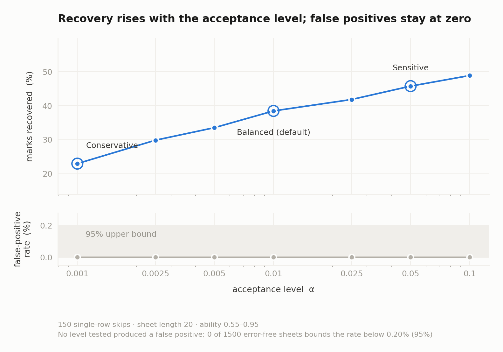

# Detecting registration errors in OMR answer sheets

This report presents the detector, its experimental evaluation, and the evidence
behind its design. The evaluation corpora are synthetic; the historical 1.8% rate
comes from Skiena and Sumazin (2004); and no confirmed operational cases are
available for calibration.

The motivating examination-sheet analysis is in [CASE_REPORT.md](CASE_REPORT.md).
The assumptions tested during development are summarized in
[ASSUMPTIONS.md](ASSUMPTIONS.md). Commands for reproducing the committed outputs
are in [REPRODUCE.md](REPRODUCE.md).

## 1. Problem and scope

An OMR pipeline produces an answer key indexed by question and marks indexed by
physical row. A registration error occurs when those indices no longer
correspond, even though the marks themselves may be correct. A skipped bubble
row and a scanner feed slip are observationally equivalent at the response-vector
level. The detector can correct the registration; it cannot identify the cause.

This report focuses on monotone registration changes: rows or questions may be
unmatched, but the order of the remaining matches is preserved. It does not solve
arbitrary page reordering, wrong booklet versions, symbol relabelling, or image
segmentation. Those possibilities are examined separately in the case study.

Registration errors belong to a wider family:

| Class | Example | Effect on the index map |
|---|---|---|
| Displacement | skipped bubble row | offset increases monotonically |
| Displacement | question skipped but its row consumed | offset decreases through an unmatched question |
| Reordering | sheet inverted or filled bottom-up | reversal |
| Reordering | wrong column or booklet applied | block or arbitrary permutation |
| Symbol | bubble columns or key legend misread | option relabelling |

The detector in this report addresses the first class and approximates only the
monotone part of some other mechanisms. It should not be described as a general
registration-error solver.

The 1.8% reference rate is from Skiena and Sumazin’s report of displacement errors
in 101,265 Scholastic Aptitude Tests, with approximately 2% corroborated on Stony
Brook undergraduate examinations. It is an external prior used for sensitivity
calculations and model configuration, not a measurement made here.

### 1.1 Why detection alone is insufficient

Searching over registrations and retaining the best-scoring alignment improves
the score even on a clean sheet, because the search guarantees that it will find
the most favorable path. The problem is therefore discrimination, not alignment
alone. Under LCS scoring, a random 46-question, four-option sheet scores an
average of 27.3 out of 46, against the chance expectation of 11.5. Skiena and
Sumazin’s asymptotic argument, using Dancik’s adaptability measure, puts a
no-knowledge candidate between 0.58 and 0.75 on a four-option paper where chance
is 0.25; the maximizing strategy is to answer in long runs of one option.

These published results motivate the adversarial generators in corpus 1. They are
not measurements newly derived by this repository. Any method permissive enough
to recover a genuine error is also permissive enough to manufacture one unless it
adds an independent constraint.

## 2. Registration model

Let `k = (k₁, …, k_N)` be the key and `m = (m₁, …, m_M)` the marks, over an
alphabet of `C` options. A registration is a partial map `π` from questions to
rows with:

1. `π` is strictly increasing on its domain;
2. no row is used twice;
3. `|π(q) − q| ≤ D`, with `D = 3` by default; and
4. an unmatched question receives no credit.

The search is therefore a banded monotone lattice-path problem. A skipped
physical row increases the offset; an unanswered question decreases it only by
leaving a question unmatched. The marks are never changed.

For a matched pair, the response model is

```text
P(m_r | k_q, θ) = θ                 if m_r = k_q
                  (1 − θ)/(C − 1)   otherwise.
```

`θ` is integrated over a 25-point midpoint grid. It is supplied by an external
ability estimate when one is available, otherwise the prior mean is used. It is
never estimated from the disputed sheet’s re-registered score. A fairness clamp
prevents unmatched questions from becoming cheaper than admitting a wrong match,
which would recreate the free-deletion failure mode of LCS.

## 3. Methods compared

Five methods see the same sheets in the comparison benchmarks:

- **No correction:** always retain the submitted registration.
- **Global displacement scan:** choose the best single offset in a bounded band.
- **Longest common subsequence (LCS):** maximize matching subsequence length;
  deletions are effectively free.
- **Fixed-cost affine alignment:** a banded Gotoh-style alignment with fixed gap
  costs and no probabilistic interpretation.
- **Gated pair HMM:** a three-state pair HMM with Viterbi decoding, forward
  likelihoods, forward-backward item posteriors, and a separate acceptance layer.

The pair HMM states are `M` (question matched to a row), `X` (question
unmatched), and `Y` (row unmatched). Transition costs are log-priors for the
registration events. Viterbi decoding finds a maximum-a-posteriori path, the
forward recursion supplies the marginal likelihood, and forward–backward gives
the per-question posterior over offsets. Ability is marginalized over the
25-point midpoint grid rather than fitted to the disputed score.

The pair HMM is a standard sequence-alignment model applied to answer options.
This repository’s contribution is the response model and decision layer,
especially the coherence-based permutation gate.

## 4. Acceptance and scoring

The default Balanced profile requires all of the following:

| Gate | Requirement |
|---|---|
| Evidence | `log₁₀ BF₁₀ ≥ 2`, where the alternative contains all non-identity registrations |
| Posterior | `P(registration error | marks) ≥ 0.95`, using the sheet slip rate as prior odds |
| Monte Carlo | worst-of-three-null coherence p-value `≤ 0.010` |
| Segment coherence | each displaced segment has at least 5 items and exact binomial `p ≤ 0.01` |
| Non-triviality | MAP registration differs from identity |

The three nulls preserve different aspects of the data: key-option marginals,
circular rotation of the candidate sequence outside the displacement band, and a
block bootstrap of the candidate sequence. The test statistic is the largest
chance-corrected run of matches over all non-zero offsets and windows of at least
five items. Its Monte Carlo calibration searches the same space as the observed
statistic, so the window and offset multiplicity is included.

In notation, the statistic is

```text
T = max over d ≠ 0 and contiguous windows W, |W| ≥ L,
    −log₁₀ P(at least k of |W| answers are correct | chance = 1/C).
```

The key-marginal null resamples options using the key’s own marginal frequencies.
The rotation null moves the candidate sequence by an amount outside the allowed
displacement band, preserving its runs. The block bootstrap resamples contiguous
blocks of the candidate sequence and preserves local dependence. The reported
p-value is the largest of the three null-specific p-values. Where an analytic
multiple-testing correction is shown in a case analysis, the search-space
correction is applied to the same family of offsets and windows.

The statistic was selected in a positive-control experiment. Its p-value for a
planted displacement was 0.0003, compared with 0.143 for raw score gain, 0.018
for Viterbi score gain, and 0.025 for the forward evidence ratio. This is a
synthetic comparison, not a universal proof that coherence is optimal.

Passing the sheet-level gates is not enough to award all aligned marks. A question
is moved only if its posterior probability for the MAP offset is at least 0.99.
Questions that become wrong are counted as losses. This item-level ledger is part
of the public API’s explanation output.

### 4.1 Configuration and policy inputs

The following values are defaults in `AdjudicationConfig`. They are separated
from the named acceptance profiles because they are model or board inputs rather
than operating points.

| Parameter | Default | Role |
|---|---:|---|
| `sheet_slip_rate` | 0.018 | Prior probability that a sheet contains a slip |
| `external_ability` | prior mean 0.60 | Ability evidence supplied independently of the sheet |
| `external_concentration` | 60 | Beta pseudo-counts for an external ability estimate |
| `max_displacement` | 3 | Maximum absolute row offset searched |
| `row_skip_extend` | 0.15 | Prior continuation probability for a row slip |
| `blank_rate` | 0.02 | Prior probability of an unanswered question |
| `blank_extend` | 0.30 | Prior continuation probability for unanswered questions |
| `blank_safety` | 0.5 | Fairness clamp on unmatched-question cost |
| `theta_grid_size` | 25 | Midpoint grid points used for ability marginalization |
| `item_posterior_threshold` | 0.99 | Minimum per-question posterior for moving a mark |
| `segment_binom_alpha` | 0.01 | Per-segment exact binomial threshold |
| `min_segment_length` | 5 | Internal minimum displaced-segment length |
| `seed` | 20260804 | Default deterministic seed |

The Bayes-factor threshold is 100 and the posterior threshold is 0.95. The
Monte Carlo level and draw count are coupled by the selected profile:

| Profile | Monte Carlo level | Draws |
|---|---:|---:|
| Conservative | 0.001 | 9,999 |
| Balanced | 0.010 | 999 |
| Sensitive | 0.050 | 199 |

The smallest p-value an add-one permutation test can report is `1/(B+1)`. The
implementation derives the draw count as `ceil(10 / alpha) − 1` and rejects an
unreachable alpha/count pair at construction. This coupling is part of the
detector’s correctness, not just a performance convenience.

## 5. Corpus 1: model comparison

`benchmark/omrbench.py --n 12` evaluates 10 candidate-response generators, with
12 clean and 36 error sheets per generator. The pooled results in
`results/benchmark.txt` are:

| Detector | Worst clean FPR | Recovery | Unearned marks, raw | Unearned marks at 1.8% |
|---|---:|---:|---:|---:|
| No correction | 0.000 | 0% | 0.19 | 0.005 |
| Global displacement scan | 0.417 | 31% | 0.47 | 0.239 |
| LCS | 1.000 | 100% | 4.21 | 3.688 |
| Fixed-cost affine alignment | 1.000 | 99% | 1.46 | 1.084 |
| **Gated pair HMM** | **0.000** | **33%** | **0.19** | **0.005** |

The raw mean is taken over cells with three error sheets per clean sheet. The
reweighted column is a bookkeeping calculation at the external 1.8% rate, not a
deployment forecast. Each individual clean-cell FPR is based on only 12 sheets;
zero observed false positives there has a 95% Clopper–Pearson upper bound of 22.1%.

For transparency, corpus 1’s comparative Brier scores are 0.750 for no correction,
0.465 for the displacement scan, and 0.084 for the gated HMM; LCS and fixed-cost
alignment do not report confidence and therefore have no Brier score. Decision
schema completeness is 1.000 for no correction, the displacement scan, and the
gated HMM, 0.833 for fixed-cost alignment, and 0.529 for LCS. These are in-corpus
comparators, not deployment calibration.

The generator-level pattern is informative. LCS fails on every generator to some
degree, with clean-cell FPR from 0.25 to 1.00. Fixed-cost alignment is especially
vulnerable to run-heavy and regime-changing responses: it has non-zero clean-cell
FPR on `adversarial_adaptable`, `streaky_guesser`, `nonstationary_ability`, and
`two_regime`. The gated detector observed zero false positives in every generator
cell, but those small cells alone are not a strong safety bound.

The response-model advantage is explicit: the benchmark supplies the gated HMM
with the true generating ability, while the baselines have no equivalent input.
The headline power should therefore be read as conditional on the external
ability input being reasonable; the repository does not establish performance
when that input is unavailable or badly wrong.

The clean-sheet FPR by response generator is shown below. Each cell contains 12
clean sheets, so this table is for diagnosing failure modes rather than making a
strong pooled safety claim.

| Generator | No correction | Gated HMM | Displacement scan | Fixed-cost | LCS |
|---|---:|---:|---:|---:|---:|
| `adversarial_adaptable` | 0.000 | 0.000 | 0.417 | 1.000 | 1.000 |
| `streaky_guesser` | 0.000 | 0.000 | 0.000 | 0.417 | 1.000 |
| `nonstationary_ability` | 0.000 | 0.000 | 0.000 | 0.167 | 1.000 |
| `two_regime` | 0.000 | 0.000 | 0.000 | 0.167 | 0.917 |
| `topic_clustered` | 0.000 | 0.000 | 0.000 | 0.000 | 0.667 |
| `irt_2pl` | 0.000 | 0.000 | 0.000 | 0.000 | 0.583 |
| `clean` | 0.000 | 0.000 | 0.000 | 0.000 | 0.500 |
| `attractive_distractor` | 0.000 | 0.000 | 0.000 | 0.000 | 0.417 |
| `time_truncated` | 0.000 | 0.000 | 0.000 | 0.000 | 0.333 |
| `option_bias` | 0.000 | 0.000 | 0.000 | 0.000 | 0.250 |

The fixed-cost failures occur on the four generators that create long option
runs or regime changes. The gated model’s run-preserving rotation and block
bootstrap nulls make those patterns ordinary under the candidate’s own response
behavior. In the separate 300-clean-sheet profile calibration, rotation was the
binding null 185 times and block bootstrap 79 times; together they were binding
in 88% of cases. This is the concrete reason the gate matters, rather than an
abstract claim that fixed costs are negotiable.

## 6. Corpus 2: independent large benchmark

`benchmark/large_synthetic.py --full` evaluates 9,984 sheets from separate
generator code: 3,840 clean sheets and 6,144 with planted errors. It includes 11
response models, 18 mechanisms, scanner artefacts, multiple paper lengths, and
five-option cases. The committed default summary is in
`results/large_synthetic/summary.txt` and `.json`.

| Detector | FP / clean | FPR | Correctly localized power | Recovery | Unearned marks |
|---|---:|---:|---:|---:|---:|
| No correction | 0 / 3,840 | 0.0000 | 0% | 0% | 2,665 |
| **Gated pair HMM** | **0 / 3,840** | **0.0000** | **11.2%** | **27.9%** | **2,703** |
| Global displacement scan | 520 / 3,840 | 0.1354 | 7.6% | 55.5% | 11,065 |
| Fixed-cost affine alignment | 1,028 / 3,840 | 0.2677 | 18.3% | 42.5% | 29,940 |
| LCS | 3,201 / 3,840 | 0.8336 | 0% | 89.8% | 141,249 |

For the gated HMM, 688 detections were correctly localized and 207 were
mislocalized. It returned 29,036 of 104,024 marks at stake and awarded 2,703
unearned marks, compared with the no-correction floor of 2,665. The zero-FP
observation has a pooled 95% upper bound of 0.07%. This bound is still based on
synthetic sheets and says nothing about an unrepresented real-world failure mode.

The Brier score of 0.2092 for the gated HMM is a comparative synthetic metric;
it is not evidence that a reported posterior of 0.99 is calibrated at an
operational base rate.

The same caution applies to the sheet-level posterior. It is a model posterior
formed with the configured slip-rate prior and the synthetic response model. The
benchmark contains three error sheets for every clean sheet, while the posterior
uses a 1.8% prior. That 75% benchmark error fraction is useful for comparing
detectors on identical data, but it cannot validate a 0.99 posterior as a 99%
operational correctness rate. A deployment calibration study would need confirmed
cases at an appropriate base rate.

## 7. Profiles and cohort screening

### 7.1 Profile study

The profile study is separate from both benchmark corpora. It uses 150 genuine
single-row skips and 300 clean 20-question sheets for calibration, plus 1,500
clean sheets for a certification arm. Results:

| Profile | α | Detected | Marks back | Recovery | Minimum accepted block |
|---|---:|---:|---:|---:|---:|
| Conservative | 0.001 | 23 / 150 | 280 / 1,220 | 23.0% | 11 |
| **Balanced** | **0.010** | **46 / 150** | **469 / 1,220** | **38.4%** | **9** |
| Sensitive | 0.050 | 63 / 150 | 558 / 1,220 | 45.7% | 8 |



This is a policy trade-off plot from the profile study, not a false-positive-rate
calibration plot. The acceptance level is a policy input; the observed clean-sheet
certification bound is reported separately below.

At the default level, the sole failing gate in 49 rejection cases was the Monte
Carlo gate. The configured minimum segment length of five did not set the observed
floor; the permutation burden did. The loosest certification arm observed zero
false positives in 1,500 clean synthetic sheets at α = 0.1, giving a 95% exact
upper bound of 0.20%. An illustrative conversion to unearned marks assumes ten
marks per false acceptance; that assumption is not measured and scales the result
linearly.

The profiles are policy choices, not data-derived significance guarantees. The
repository defaults to Balanced because Conservative produced no observed safety
benefit in the profile study while recovering fewer marks. Synthetic data cannot
settle the operational choice.

### 7.2 Cohort screening

`CohortScreen` applies a Benjamini–Hochberg step-up procedure to per-sheet
p-values. It can remove sheets from the per-sheet decisions but cannot add any,
so it is not more permissive than individual adjudication.

The committed 4,000-sheet simulation uses 46-question papers, a 1.8% generated
skip rate, target FDR `q = 0.05`, and 79,999 permutation draws per sheet. It
contains 61 genuine skips and 3,939 clean sheets. The per-sheet gate flags 33
sheets; the cohort screen retains 22, all genuine. The observed false-discovery
rate is 0, with a 0.076% exact upper bound for the clean-sheet false-positive
rate. This demonstrates the mechanics of the screen on synthetic data; it is not
validation of a board-wide deployment.

The draw count is derived from cohort size and target FDR. If the permutation
resolution is too coarse, no sheet can reach the cohort threshold. Paper length,
cohort size, and the detector’s low power therefore interact: a short paper may
produce no screenable discoveries even when the per-sheet gate finds some.

## 8. Case study

The motivating case is a candidate reported to have scored well elsewhere who
received 7/46 in mathematics. The available mathematics rows agree with the
marking record; the other 104 answer-key entries are unavailable.

The default case output reports posterior shift probability 0.023378, log₁₀
Bayes factor 0.1159, Monte Carlo p-value 0.9010, and the identity MAP alignment.
No acceptance gate passes, so no re-registration is supported and the original
score stands. A planted shift on the same key is accepted as a positive control.

The case report also tests reversal, rotation, option relabelling, block/column
permutation, combined symbol-plus-displacement, answer-count invariance, mutual
information, and sequence structure. Those are exploratory analyses of one
sheet, not validation of the detector. Rows 47–150 used in two analyses were
transcribed from an image without independent verification.

## 9. What the auxiliary experiments show

The repository records several negative or diagnostic experiments:

- IRT emissions calibrated on 400 cohort sheets recovered item difficulty with
  correlation `r = 0.992`, but held-out power changed from 0.625 to 0.650 with
  zero false alarms (40 shifted and 40 clean sheets per model).
- Moving item difficulty into the coherence statistic gave power 0.773 for the
  plain statistic and 0.768 for the weighted statistic over 220 shifted and 220
  clean paired sheets; McNemar’s exact two-sided p-value was 1.000.
- Escalating the asserted external ability prior makes the Bayes-factor gate pass
  at concentration 120, but the Monte Carlo p-value remains 0.8914 in all eight
  stress-test rows. The ability-independent gate is therefore the load-bearing
  safeguard, not proof that the other gates are immune to policy choices.

These are bounded experiments with synthetic data. They support the stated design
choices; they do not show that richer inputs such as scanner intensity, erasures,
timing, or cohort response frequencies would fail to help.

## 10. Complexity and implementation details

With `N` questions, displacement band `D`, ability-grid size `G`, and `B`
permutation draws, the principal costs are:

| Stage | Time | Space |
|---|---|---|
| Viterbi, forward, forward-backward | O(ND) each | O(ND) |
| Ability marginalization | O(GND) | O(ND) |
| Coherence scan | O(DN²) with prefix sums | O(N) |
| Monte Carlo calibration | O(BDN²) | O(B) |

The implementation uses log-space likelihoods, exact binomial tails, deterministic
seeding, and optional NumPy batching. The default configuration derives its draw
count from the profile level; an unreachable level/draw combination is rejected
at construction. The invariant tests check monotonicity, injectivity, score
bounds, mark immutability, profile nesting, and deterministic relabelling
properties.

## 11. Limitations and research status

The central limitation is informational: a response vector alone contains little
evidence for a short or low-ability displaced block. The detector is deliberately
conservative and often remains silent. In corpus 2 its correctly localized power
is 0.112, and 207 of 895 detections are mislocalized.

Other limitations are substantive:

- The single-ability response model is wrong for topic-correlated difficulty,
  fatigue, regime changes, and other dependence structures. The benchmark shows
  low power on several such conditions, even when false positives remain zero.
- A non-monotone event such as answering a skipped question later is outside the
  exact path family. In the mechanism benchmark, the approximate monotone method
  detects it in 0.671 of cases with median localization error one, but that is not
  exact recovery.
- The detector assumes a clean extracted sequence. Scanner artefacts are present
  in the large synthetic corpus but are not a substitute for real image-level
  validation.
- The 1.8% base rate, maximum displacement three, mechanism mixture, and source
  of external ability must be replaced or justified by a board. The code does not
  estimate them from confirmed cases.
- The ability integral is a 25-point midpoint approximation. Bayes factors and
  posteriors inherit that numerical approximation.
- The reported score is a count of correct answers. A marking scheme with
  negative marking must be applied separately to the resulting registration.
- Sheet design can prevent long displaced blocks from forming, reducing the
  damage of a slip but also removing the evidence this detector needs. A block
  shorter than the measured profile floor may be undetectable from one sheet.

The project’s current research status is therefore: a reproducible synthetic
benchmark and an auditable reference implementation, with useful safety
mechanisms and low measured recovery. The next evidence needed is a governed
corpus of confirmed historical cases, paired with original images and digitized
marks, plus evaluation of richer image and cohort features.

## 12. Detailed experimental record

The main sections establish the method and headline findings. The detailed record
below gives the supporting measurements behind them: the complete mechanism
breakdown, policy arithmetic, decision schema, and failure patterns that motivated
the safeguards. Unless stated otherwise, these numbers come from committed
synthetic outputs under `results/`.

### 12.1 Mechanism-level operating characteristics

`results/benchmark_mechanisms.txt` evaluates seven mechanisms with five response
generators and 14 sheets per generator–mechanism cell. `FIRE` is the fraction of
sheets on which the detector accepts a correction; `AWARD` is mean unearned marks;
`HOLD` is mean marks withheld from a candidate; and `LOC` is median localization
error in questions. The no-op values in parentheses are the corresponding
no-correction harm on error sheets.

| Mechanism | Gated fire | Gated award | Gated hold | Median location error |
|---|---:|---:|---:|---:|
| No error | 0.000 | 0.00 | 0.00 | — |
| Self-corrected shift | 0.671 | 0.00 | 3.63 | 0 |
| Deferred question | 0.686 | 0.06 | 4.30 | 1 |
| Anxiety shift | 0.486 | 0.16 | 3.37 | 3 |
| Isolated misplacement | 0.000 | 0.04 | 1.23 | — |
| Boundary slip | 0.629 | 0.04 | 3.54 | 1 |
| Early full shift | 0.857 | 0.00 | 4.14 | 0 |

The no-error row is the false-alarm control. The isolated misplacement is a
particularly important negative case: it is worth one mark, and correcting it is
not beneficial. The early full shift is the most costly mechanism when left
untreated; the no-op holds 19.76 marks on average versus 4.14 after the gated
decision. A deferred question is outside the exact monotone model, so its firing
rate is not evidence of exact recovery.

The other methods illustrate the safety–recovery trade-off. On a clean mechanism
control, LCS fires 0.671 and awards 2.89 marks per sheet; fixed-cost alignment
fires 0.100 and awards 0.50. On `early_full_shift`, both LCS and fixed-cost
alignment fire 1.000, while the gated model fires 0.857 with no unearned marks in
this small mechanism run. On `isolated_misplacement`, LCS fires 0.929 and
fixed-cost alignment 0.143; the gated method fires 0.000.

### 12.2 Ability and displacement magnitude

The validation output `results/validation.json` measures six synthetic conditions,
with 30 sheets per ability–magnitude cell. Correctly localized power is:

| Ability | One-row shift | Two-row shift |
|---:|---:|---:|
| 0.55 | 0.333 | 0.067 |
| 0.70 | 0.767 | 0.233 |
| 0.85 | 0.933 | 0.450 |

These rates are for that validation harness, not a general power curve. They show
why an external ability estimate is a consequential input: a low-consistency
response sequence cannot create a strong displaced block, especially after a
two-row shift. The large corpus supplies the detector with the generating ability
and should consequently be read as a favorable conditional experiment.

### 12.3 Profile arithmetic and the observed detection floor

The policy study uses 300 clean 20-question sheets for p-value calibration, 150
single-row skips for recovery, and 1,500 clean sheets for the all-profile safety
arm. The exact committed profile output is:

| Alpha | Profile | Detected | Marks recovered | Recovery | Wrongly removed | Mislocalized | Minimum accepted block |
|---:|---|---:|---:|---:|---:|---:|---:|
| 0.001 | Conservative | 23/150 | 280/1,220 | 23.0% | 0 | 0 | 11 |
| 0.010 | Balanced | 46/150 | 469/1,220 | 38.4% | 0 | 0 | 9 |
| 0.050 | Sensitive | 63/150 | 558/1,220 | 45.7% | 0 | 0 | 8 |

The internal segment length is five, but it did not determine these floors. At
the default level, the Monte Carlo gate was the sole failing gate in 49 rejection
cases. The p-value calibration arm found values below nominal 0.5 in 25/300
clean sheets, below 0.25 in 8/300, below 0.1 in 2/300, below 0.05 in 1/300, and
below 0.01 or 0.001 in 0/300. The worst-of-three null was rotation in 185 cases,
block bootstrap in 79, and key-marginal resampling in 36.

The 1,500-sheet certification arm uses alpha 0.1, looser than every named profile.
It observes zero false positives, so the exact 95% upper bound is 0.20%. If a
board assumes ten unearned marks per false acceptance, the corresponding upper
bound is 0.0196 unearned marks per sheet at a 1.8% base rate. The ten-mark factor
is not measured and scales this calculation directly.

### 12.4 Cohort screening: resolution and monitoring

Individual adjudication and cohort screening answer different questions. A
per-sheet p-value threshold does not by itself control the expected fraction of
wrong sheets among thousands of flagged candidates. `CohortScreen` applies the
Benjamini–Hochberg step-up procedure at target FDR `q`, reports the expected false
discoveries, and never adds a sheet that the per-sheet gate rejected.

The smallest reportable permutation p-value is `1/(B+1)`, where `B` is the number
of draws per sheet. For a cohort of `m` sheets, the BH threshold can be smaller
than that resolution. `draws_required` derives a sufficient draw count and
`check_resolution` rejects an impossible configuration. Without that check, a
run could return zero flagged sheets simply because no p-value was representable.

The trigger monitor should not be compared with the raw 1.8% error rate. Its
expected rate is approximately base rate × detector power. Using the large-corpus
power 0.112 gives 0.018 × 0.112 = 0.00202, or 0.202%. Treating 1.8% as the
expected trigger rate would make ordinary low power look like a pipeline failure.

For the committed 4,000-sheet, 46-question simulation, `B = 79,999`, the BH
threshold is 0.000100, and the expected false-discovery count at `q = 0.05` is
1.10. There are 61 generated skips and 3,939 clean sheets. The per-sheet gate
flags 33; the cohort screen retains 22, all genuine. The observed false-discovery
rate is 0, and the clean-sheet false-positive upper bound is 0.00076.

The screen’s recall loss is part of the result: 11 of 33 correct per-sheet
detections are removed by the cohort-level adjustment. A board using shorter
papers or larger cohorts must evaluate the resolution condition before treating
an empty screen as evidence that no shifts exist. The repository does not include
a committed 20-question cohort output, so this report does not present exact
20-question screening counts as measured results.

### 12.5 Decision schema and auditability

Every detector in the comparison is adapted to the same result schema:

| Field | Meaning |
|---|---|
| `accepted` | Whether the method accepts a non-identity registration |
| `shift_locations` | Estimated change points or offsets |
| `confidence` | A posterior or method-specific confidence, when available |
| `evidence` | Gate values and supporting statistics |
| `explanation` | Human-readable reasons for acceptance or rejection |
| `alignment` | The question-to-row mapping used for scoring |

Baselines that cannot populate a field are scored as incomplete. This is why the
corpus reports schema completeness alongside harm and recovery. The gated method
returns the gates separately, all three null p-values, the MAP alignment, item
posteriors, and the mark ledger. It is designed so that an appeal can inspect why
a particular question moved or stayed put.

### 12.6 Numerical break-even and fairness clamp

For ability `θ`, option count `C`, and per-position slip hazard `ε`, the simple
break-even diagnostic is:

```text
break-even = −log ε / [log θ − log((1 − θ)/(C − 1))]
```

It expresses how many newly repaired answers are needed before the likelihood
advantage of a displaced reading offsets the prior rarity of a slip. It is not a
replacement for the full gates. The value depends on the operating ability and
the transition model; the motivating case output reports 2.55 questions at the
default operating point.

Unmatched questions have a blank-run cost. If discarding a question were cheaper
than admitting a wrong match, a model could discard its own errors to buy alignment
freedom. The implementation clamps the blank cost:

```text
log ε_blank(θ) = min(log ε_blank,
                    log((1 − θ)/(C − 1)) + log(blank_safety))
```

with `blank_safety = 0.5` by default. This preserves the intended ordering at
every admissible ability and is the direct structural response to LCS’s free
deletion behavior.

### 12.7 What was considered and not adopted

Several alternatives were considered but are not implemented as primary methods:

- Integer programming adds a solver dependency to a monotone assignment problem
  whose constraint matrix is totally unimodular; dynamic programming reaches the
  same optimum under the current constraints.
- MCMC would add sampling error to a banded state space that can be evaluated by
  dynamic programming and forward–backward recursions.
- IRT is represented by the auxiliary extension, but no IRT rival is used as a
  primary benchmark method. Cook (2013) provides a real-data comparison; this
  repository does not.
- Conditional random fields and weighted finite-state transducers could subsume
  the pair HMM. They become useful if scanner confidence, bubble darkness,
  section boundaries, timing, or cohort frequencies are added; those labels are
  not available here.
- Supervised classification lacks a labelled corpus of confirmed registration
  errors and would offer a less transparent appeal rule.
- CUSUM and binary segmentation are retained as exploratory change-point tools in
  `analysis/latent_structure.py`; they do not enforce injectivity or produce a
  registration and are not primary detectors.

### 12.8 Benchmark design and measurement schema

No public benchmark for this response-sequence registration problem was located.
The published OMR literature considered here focuses on image processing—bubble
localization, deskewing, and page registration—rather than the subsequent
question of whether an extracted sequence is aligned with the key.

Corpus 1 has ten candidate behavior models. The reference model uses constant
ability, uniform distractors, and independent items. The other generators vary
item difficulty and discrimination (`irt_2pl`), topic clustering, an attractive
distractor, declining ability, a two-regime candidate, time truncation, streaky
guessing, option bias, and Dancik’s maximum-adaptability string. These are
deliberate stress conditions, not a claim that they occur with measured
deployment frequencies.

The first benchmark’s comparison arm uses one-row skips, two-row skips, and two
separate slips. The mechanism arm uses self-corrected shifts, deferred questions,
anxiety shifts, isolated misplacements, boundary slips, and early full shifts.
They are separate runs with different mechanism sets, which is why their tables
should not be interpreted as one single balanced sample.

The benchmark measures three families of outcomes: detection, harm, and
transparency. Harm is split into marks wrongly awarded and marks wrongly
withheld. Transparency includes schema completeness, localization error, Brier
score, and expected calibration error. The last two are comparative metrics only
because all benchmark cells are dominated by synthetic error sheets.

The real-data schema is present but empty: no confirmed historical re-marks are
available. Such a corpus would allow the base rate, displacement distribution,
mechanism mix, and operational calibration to be measured rather than assumed.

### 12.9 Safeguards against misuse

Because a wrong correction can affect examination results, these safeguards are
part of the method:

1. **Marks are not decision variables.** The search can choose only a monotone
   question-to-row path. It cannot edit, reorder, or invent an answer.
2. **Rows are not reused.** Strict injectivity prevents one favorable physical mark
   from answering two questions.
3. **Blank insertion is priced.** The fairness clamp prevents discarding wrong
   answers from becoming a cheap way to buy alignment freedom.
4. **Evidence must be contiguous.** Scattered accidental matches cannot sum to an
   acceptance. The run-preserving nulls specifically address streaky strategies.
5. **All five gates are required.** The optimizer always returns a best path; it
   does not decide that the path is real without the separate acceptance layer.
6. **Credit is item-level.** A question moves only at or above the 0.99 posterior
   threshold, and a newly wrong answer is a loss.
7. **Ability-independent evidence is decisive.** The Monte Carlo criterion
   does not use an asserted candidate ability. The stress test shows that the
   likelihood gates can be bought by a strong prior assertion, while this gate
   remains at 0.8914 and the verdict stays rejected across all eight rows.

These safeguards constrain the type of correction the software can make. They do
not prevent a candidate from producing evidence that is genuinely ambiguous, and
they do not identify copying or collusion. A displaced block copied from another
sheet can be observationally identical; that is outside the scope of a single
sheet response-sequence detector.

## 13. Implementation complexity and reproducibility details

With `N` questions, displacement band `D`, ability-grid size `G`, and `B`
permutation draws, the principal costs are:

| Stage | Time | Space |
|---|---|---|
| Viterbi, forward, forward-backward | O(ND) each | O(ND) |
| Ability marginalization | O(GND) | O(ND) |
| Coherence scan | O(DN²) with prefix sums | O(N) |
| Monte Carlo calibration | O(BDN²) | O(B) |

The band makes dynamic programming linear in paper length for fixed displacement
bound. Without banding, the alignment grid is quadratic. Enumerating multiple
change-point sets directly would be exponential in the number of events, which is
why the path model and scan statistic are used.

The Monte Carlo stage is batched when NumPy is available. Draws are generated in a
fixed order so the random stream remains reproducible; a scalar path is available
without NumPy. Early stopping is exact for a fixed acceptance decision once the
exceedance budget has been exhausted. The public timing claims were removed from
the headline documentation because they were environment-specific and not part
of the scientific result.

Results include code fingerprints, parameters, and environment information. The
control suite additionally checks that false positives are observable, since a
broken counter and a perfectly safe detector can otherwise both report zero.

## 14. Limitations and failure modes in more detail

### 14.1 Recovery is uneven

The detector returns only 27.9% of marks at stake in corpus 2 and remains silent
on most genuine errors. This is the intended safety–recall trade, not an
implementation bug that the current evidence has solved. Weak candidates and
larger shifts are especially difficult because chance-aligned blocks are not
distinguishable from genuine ones.

### 14.2 Non-stationarity and correlated difficulty

A candidate who is strong early and weak later can create a change-point-like
pattern at the identity alignment. Topic clusters can create runs of correct
answers that are not registration errors. The current chance model assumes
conditional item exchangeability, so correlated difficulty can make its p-values
anti-conservative. Cohort response frequencies or item-level evidence would be
needed to address this.

### 14.3 Non-monotone events

Answering a skipped question later produces a non-monotone registration. The
current path family excludes it; its mechanism benchmark entry is an approximate
monotone explanation, not a proof that the detector can recover the true event.

### 14.4 Scanner and marking rules

The core response sequence assumes that marks have already been digitized. Faint
bubbles, erasures, and double marks can cause the same observed symptoms and should
be inspected before statistical adjudication. The code counts correct answers; it
does not apply the motivating board’s `+1 / −0.15` scoring rule. A board must apply
its own scoring policy after deciding a registration.

### 14.5 Sheet design trade-off

Visual blocks or anchor rows can limit how far one slip propagates. That reduces
the harm of an undetected error, but it also removes the long displaced block that
the detector needs as evidence. Under the profile study, the measured minimum
accepted block is 8–11 correct marks on a 20-question paper, depending on policy.
A slip confined to a shorter block can be invisible from the response sequence
alone. The board must choose whether it prefers lower potential damage or more
recoverable evidence; the detector cannot infer the missing evidence.

The search burden explains the floor. On a 20-question paper with displacement
bound 3, the coherence scan considers 632 non-zero-offset windows. Under a
four-option chance model, the approximate tail probabilities and expected number
of spurious all-correct blocks are:

| Correct block | Chance tail p | Expected spurious hits per sheet |
|---:|---:|---:|
| 5 | 9.8 × 10⁻⁴ | 0.62 |
| 6 | 2.4 × 10⁻⁴ | 0.15 |
| 8 | 1.5 × 10⁻⁵ | 0.010 |
| 10 | 9.5 × 10⁻⁷ | 0.001 |

This is why a five-item block is not enough evidence after searching every offset
and window. Restricting the search using known page breaks or anchor rows would
reduce the multiplicity and lower the floor by roughly three or four items. A
five-item block under the current search would instead need substantially richer
per-item evidence, such as optical intensity or erasure information; a more
complex model of the same answer sequence does not create that information.

### 14.6 What would improve the study

The most valuable next dataset is a governed collection of confirmed historical
cases with original images, verified digitization, known registration outcomes,
and the board’s actual mechanism frequencies. Fifty confirmed re-marks would be a
useful first target for replacing the external base-rate and displacement
assumptions, but that number is a planning suggestion, not a result. Additional
features worth testing are optical intensity, erasure traces, double-mark flags,
section boundaries, per-question timing, and cohort response frequencies.

## References

Durbin, R., Eddy, S., Krogh, A. and Mitchison, G. (1998). *Biological Sequence
Analysis*. Cambridge University Press.

Skiena, S. and Sumazin, P. (2004). “Shift error detection in standardized exams.”
*Journal of Discrete Algorithms*, 2(3), 313–331.

Cook, R. J. (2013). *Application of Item Response Theory Models to the Algorithmic
Detection of Shift Errors on Paper and Pencil Tests*. Doctoral dissertation,
University of Massachusetts Amherst. doi:10.7275/d9sx-mq12.

Gotoh, O. (1982). “An improved algorithm for matching biological sequences.”
*Journal of Molecular Biology*, 162(3), 705–708.

Needleman, S. B. and Wunsch, C. D. (1970). “A general method applicable to the
search for similarities in the amino acid sequence of two proteins.”
*Journal of Molecular Biology*, 48(3), 443–453.

Viterbi, A. J. (1967). “Error bounds for convolutional codes and an
asymptotically optimum decoding algorithm.” *IEEE Transactions on Information
Theory*, 13(2), 260–269.

Rasch, G. (1960). *Probabilistic Models for Some Intelligence and Attainment
Tests*. Danish Institute of Educational Research.

Birnbaum, A. (1968). “Some latent trait models and their use in inferring an
examinee’s ability.” In Lord, F. M. and Novick, M. R. (eds.), *Statistical
Theories of Mental Test Scores*. Addison–Wesley.

Benjamini, Y. and Hochberg, Y. (1995). “Controlling the false discovery rate.”
*Journal of the Royal Statistical Society, Series B*, 57(1), 289–300.

Clopper, C. J. and Pearson, E. S. (1934). “The use of confidence or fiducial
limits illustrated in the binomial.” *Biometrika*, 26(4), 404–413.

Wilson, E. B. (1927). “Probable inference, the law of succession, and statistical
inference.” *Journal of the American Statistical Association*, 22(158), 209–212.

Jeffreys, H. (1961). *Theory of Probability*, 3rd ed. Oxford University Press.

Davison, A. C. and Hinkley, D. V. (1997). *Bootstrap Methods and Their
Application*. Cambridge University Press.

McNemar, Q. (1947). “Note on the sampling error of the difference between
correlated proportions or percentages.” *Psychometrika*, 12(2), 153–157.

Lempel, A. and Ziv, J. (1976). “On the complexity of finite sequences.”
*IEEE Transactions on Information Theory*, 22(1), 75–81.

Dancik, V. (1994). *Expected Length of Longest Common Subsequences*. PhD thesis,
University of Warwick.
